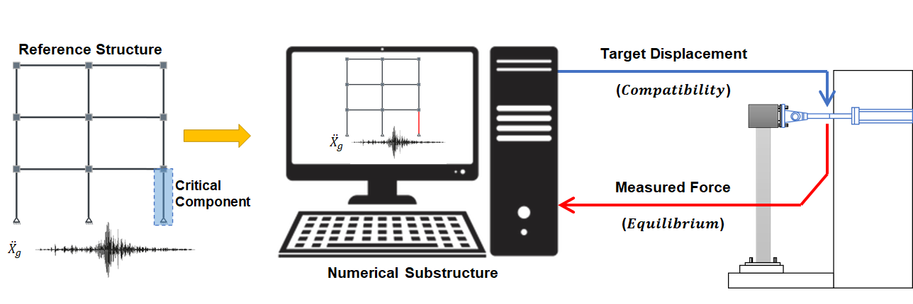
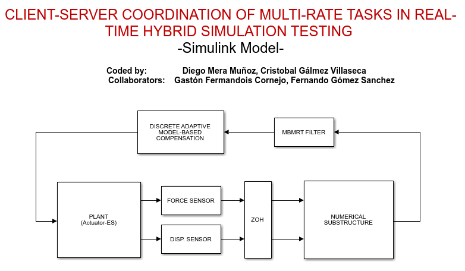

# Client-Server application for vRTHS

## Description

The example provided here is a three-story planar frame with two bays is chosen as reference structure, with a total of 30 degrees of freedom (9 lateral, 9 vertical, and 12 rotational). The reference structure is divided into the numerical substructure (NS) and experimental substructure (ES). One column of the first story is taken as the ES, while the rest is modeled as NS. Since it is intended to work only with a uniaxial actuator, the boundary degrees of freedom are set to be only horizontal displacements.

It is important to mention that these substructures, numerical and experimental, can be replaced by the substructures desired by the user.

## How to cite
Mera, D., & Fermandois, G. (2022). "Client-Server coordination of multi-rate tasks in real-time hybrid
simulation testing." https://zenodo.org/badge/latestdoi/431621234.

## Requirements

- Windows 7 or superior
- Matlab R2020b or superior
- Simulink Desktop Real-time
- Python (The authors recommend the use of Anaconda. Anaconda is a popular Python distribution platform)

## Instructions

For the execution of this model, the following instructions must be followed.

### Simulation

Below is an image of the implementation in simulink. This image corresponds to the file `OpenSeesPy_Raspberry`. Although it is appreciated that the interconnections between the actors are simple, within these subsystems we worked with Goto and From blocks to send and receive signals. In this way, Simulink is seen to be cleaner, without so much connection by arrows.

A short description of each subsystem can be seen next here:

* Numerical Substructure: This block contains communication with the numerical substructure implemented in OpenSeesPy through TCP/IP Connect block.
* Plant (Actuator - Experimental Substructure): Inside this block is the implementation of the numerical substructure and the actuator model to be used in conjunction with its controller. In this case a P control is used.
* Discrete Adaptive Model-Based Compensation: In this block is the implementation of the compensation method to be used.
* MBMRT Filter: This block contains the implementation of the transition between rates for the continuous generation of signals.
* Sensors: As its name indicates, the sensors are located inside. Being a virtual simulation, the function of these blocks is to introduce noise to the measurement to simulate a real sensor. This noise is generated from band-limited white noise.

Before running, the Simulink model must be open, the address in Matlab must match the address where this file is located since to start it calls a function called `initializeSimulation.m`.

1. In the address bar of the file explorer where the numerical model is located, type the command CMD and press Enter. This will directly open a CMD window in the folder location that was open in explorer. For this example, write:
	* `3Stories2Bays_NumericalModel.py`
	* When executed, it will display the message 'Waiting for Simulink to start'
	* If you are having trouble running python files, you can do an internet search for running python files in cmd.
2. Run the Simulink model `OpenSeesPy_Raspberry.slx`, the variables will be loaded, and the simulation will run.

### Post-processing

To check the correct performance of the vRTHS, the following steps must be followed:

1. Open the file called `Output.m` located in the Post Processing folder.
2. If everything was executed correctly, a series of graphs will be shown together with some tables with performance criteria.

